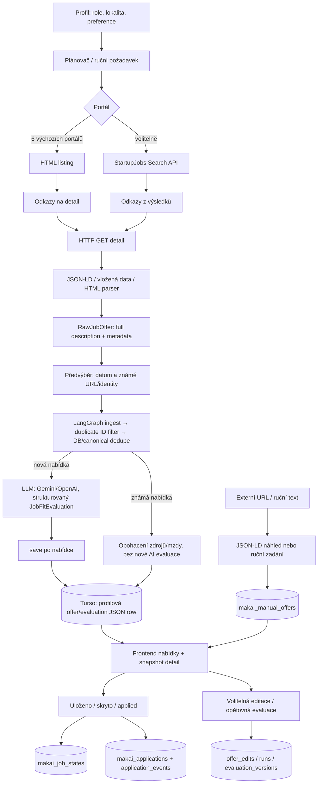

# MakAI – technický audit repozitáře

**Datum auditu:** 10. 10. 2026
**Rozsah:** zdrojový kód, konfigurace a dokumentace v pracovním stromu. Tajné hodnoty `.env` nebyly čteny ani zahrnuty. Testy ani živé služby nebyly v rámci tohoto auditu spuštěny.

## 1. Struktura projektu

Níže je úplný strom sledovaných projektových souborů a složek. Vyloučeny jsou závislosti (`venv`, `frontend/node_modules`), cache, build výstupy (`frontend/dist`), Vercel pracovní metadata (`.vercel`), Git metadata a lokální `.env` / `.env.local`.

```text
MakAI/
├── .env.example
├── .gitattributes
├── .gitignore
├── .vercelignore
├── README.md
├── agent_instructions.md
├── candidate_profile.md
├── AUDIT_REPORT.md
├── .github/
│   └── workflows/
│       ├── frontend-checks.yml
│       ├── hunt.yml
│       └── pages.yml
├── backend/
│   ├── app/
│   │   ├── __init__.py
│   │   ├── cloud_storage.py
│   │   ├── config.py
│   │   ├── db.py
│   │   ├── demo.py
│   │   ├── evaluator.py
│   │   ├── graph.py
│   │   ├── history.py
│   │   ├── hunt_filters.py
│   │   ├── profile.py
│   │   ├── profile_builder.py
│   │   ├── profile_registry.py
│   │   ├── schemas.py
│   │   ├── search_plan.py
│   │   ├── storage.py
│   │   ├── turso.py
│   │   ├── scrapers/
│   │   │   ├── __init__.py
│   │   │   ├── base.py
│   │   │   ├── portals.py
│   │   │   ├── startupjobs.py
│   │   │   └── structured.py
│   │   └── utils/
│   │       ├── __init__.py
│   │       ├── fingerprint.py
│   │       └── sources.py
│   ├── tests/
│   │   ├── test_canonical.py
│   │   ├── test_cloud_storage.py
│   │   ├── test_evaluator.py
│   │   ├── test_graph.py
│   │   ├── test_history.py
│   │   ├── test_hunt_filters.py
│   │   ├── test_ingestion.py
│   │   ├── test_local_hunt.py
│   │   ├── test_manual_evaluation.py
│   │   ├── test_portals.py
│   │   ├── test_profile.py
│   │   ├── test_profile_builder.py
│   │   ├── test_profiles_local.py
│   │   ├── test_turso.py
│   │   └── test_cloud_storage.py
│   ├── cloud_worker.py
│   ├── local_api.py
│   ├── requirements.txt
│   ├── run_hunt.py
│   └── run_local.py
├── data/                         # lokální, gitignored runtime data
├── docs/
│   ├── application-management.md
│   ├── online-setup.md
│   ├── shared-storage.md
│   ├── ux-audit-2026-10-09/
│   │   ├── AUDIT.md
│   │   ├── application.png
│   │   ├── desktop.png
│   │   ├── measurements.json
│   │   ├── mobile.png
│   │   └── onboarding.png
│   └── ux-redesign-2026-10-09/
│       ├── CHANGES.md
│       ├── application.png
│       ├── desktop.png
│       ├── measurements.json
│       ├── mobile.png
│       ├── offer-detail.png
│       ├── offer-mobile.png
│       └── profile.png
├── frontend/
│   ├── api/
│   │   ├── applications.js
│   │   ├── hunt.js
│   │   ├── jobs.js
│   │   ├── profile.js
│   │   ├── profile/cv.js
│   │   ├── profile/draft.js
│   │   ├── schedule.js
│   │   ├── session.js
│   │   └── worker.js
│   ├── public/
│   │   ├── brand/ (6 SVG loga/ikon)
│   │   ├── favicon.svg
│   │   └── templates/
│   │       ├── candidate-profile-template.json
│   │       ├── candidate-profile-template.md
│   │       └── profile-guide.md
│   ├── server/
│   │   ├── fixtures/ (cv.pdf, cv.docx)
│   │   ├── applicationStore.js
│   │   ├── cloudApi.js, cloudApi.test.js
│   │   ├── cloudAuth.js, cloudProfile.js, cloudStore.js, cloudStore.test.js
│   │   ├── externalOffer.js, offerEditing.js, offerEditing.test.js
│   │   ├── historyQuery.js, historyQuery.test.js
│   │   ├── localJobs.js, localJobs.test.js, localProfiles.js, localProfiles.test.js
│   │   ├── localProfileBuilder.js
│   │   ├── opportunityApi.js, offerTranslation.js
│   │   ├── profileBuilder.js, profileBuilder.test.js
│   │   ├── sharedLocal.js, sharedMigration.js, sharedStorage.test.js
│   │   ├── verifySharedStorage.js
│   │   └── další testy flow, aplikací, profilů, stavů a UX
│   ├── src/
│   │   ├── components/ (přihlášky, nabídky, profil, plán, login)
│   │   ├── hooks/useDraft.js
│   │   ├── lib/ (jobs, applications, profile, schedule, Turso, demo)
│   │   ├── App.jsx
│   │   ├── index.css
│   │   └── main.jsx
│   ├── branding/README.md
│   ├── index.html
│   ├── package.json, package-lock.json
│   ├── postcss.config.js, tailwind.config.js
│   ├── vercel.json, vite.config.js
│   └── README.md
└── scripts/configure_online.py
```

## 2. Sběr nabídek

### Zdroje a implementace

Backend závisí na `httpx` a BeautifulSoup (`beautifulsoup4`); JSON-LD se čte přes `json` a normalizuje do Pydantic `RawJobOffer`. Šest výchozích zdrojů je Jobs.cz, Prace.cz, JenPrace.cz, Atmoskop, Práce za rohem a DobráPráce.cz. StartupJobs má samostatný adaptér a jde spustit volitelně. Jobs.cz a StartupJobs používají dotazy odvozené z cílových rolí profilu; ostatní HTML adaptéry čtou veřejné výpisy.

### Zásadní kontrola: listing, nebo celý detail?

Scraper **rozklikává detail**. Z výpisu získá URL, následně samostatně stáhne detail URL a parsuje celé tělo popisu. U většiny portálů se bere Schema.org `JobPosting` JSON-LD; Jobs.cz umí i serverové HTML tělo. Atmoskop a Práce za rohem čtou vložená data detailu z `__NEXT_DATA__`; DobráPráce výslovně doplňuje JSON-LD teaser textem z hlavní části detailu. StartupJobs nejprve hledá přes veřejné API, pak GETuje každý detail a čte JSON-LD. Výstup ukládá `raw_description` do 30 000 znaků, včetně dostupných zdrojových podmínek. Záznam proto může obsahovat obsah už smazaného inzerátu.

To není garantovaný úplný archiv webové stránky: JavaScriptové detaily bez serverem dostupných dat, stránky vyžadující login, nevalidní či prázdný popis a nedostupné nabídky se přeskočí/chybují. Externí kariérní URL mimo doménu adaptéru se nepovažují za detail portálu.

### Síťová ochrana

- HTTP hlavička User-Agent: `MakAI/0.1 (+personal job-offer reader)`; požadavek posílá identifikaci, nikoli běžný prohlížeč.
- Timeout `httpx.Client`: 20 s. Redirecty jsou vypnuté automaticky; HTML adapter povoluje omezené přesměrování (nejvýše 6) pouze na HTTPS stejné domény a odmítá jiný host. Stránkování je omezeno na 10 stránek; kontrola detailů na 300 v jednom průchodu.
- Není vidět explicitní sleep, rate limiter ani exponenciální retry pro scraping. Jednotlivé HTTP chyby jsou převedené na redigované chyby adaptéru; jeden portál může selhat nezávisle na dalších. StartupJobs také vypíná automatické redirecty, limituje stránkování a ověřuje cílový host.
- Webový URL import má oddělené SSRF ochrany: veřejné HTTPS, DNS/IP kontrolu, limit redirectů, timeout 8 s, HTML limit; neobsahuje obecný browser renderer.

## 3. Předfiltry a kanonická identita

**Předfiltr Brna ani zakázaných slov před AI není implementován.** `HuntSelection` odfiltruje známé URL/kanonické identity, časové období a nabídky bez data (podle nastavení). `graph.filter_offers` pouze odstraní duplicitní `id`; komentář výslovně ponechává sémantické „no-go“ na evaluaci místo keyword heuristik. Lokalita, preference, jazyky a `no_go_criteria` jsou součást kandidátského profilu a promptového kontextu LLM, nikoli deterministická brána Pythonu. V profilu může být Brno preference, ale scraper ji obecně před AI nevynucuje.

`generate_canonical_id(company, title, location)` z `backend/app/utils/fingerprint.py`:

1. casefold + Unicode NFKD odstraní diakritiku;
2. firma se normalizuje a odstraní se právní formy typu s.r.o./a.s.;
3. v názvu se odstraňují genderové varianty (M/Ž, F/M…), úvazky (HPP, full-time, DPP…) a drobné absolventské/administrativní značky uvnitř závorek;
4. ostatní text názvu se zachová, mezery sjednotí, interpunkce se odstraní kromě `+` a `#`;
5. lokalita je součástí JSON payloadu; neznámá lokalita zůstává prázdná a nepáruje se automaticky s konkrétním místem;
6. SHA-256 payloadu dostane prefix `job-v1-`.

**Senioritu Junior/Medior/Senior nemaže** – ani uvnitř závorek u nové verze. Zachová i technologické tagy jako `(Python)`, `C++` a `C#`. Starší normalizace je zachována pouze jako migrační validátor historických ID. Deduplikace používá také URL a v databázi jedinečný index nad `canonical_id`.

## 4. Kognitivní jádro

### Graf LangGraph

Uzly: `ingest` (validuje dávku a resetuje průběžný state), `filter` (duplicitní ID), `deduplicate` (canonical ID/URL, databázové hledání a obohacení), `evaluate` (jedna nabídka), `save` (jedna evaluace). Hrany:

```text
START → ingest → filter → deduplicate ──(nabídka zbyla)──→ evaluate → save
                                      └──(nic)───────────→ END
save ──(další nabídka, bez stop chyby/limitu)──→ evaluate
save ──(konec / blokace / limit)───────────────→ END
```

State `MakAIState`: `offers: list[JobOffer]`, `evaluations: dict[id, JobFitEvaluation]`, `errors: list[str]`; průběžné volitelné položky `skipped_duplicates`, `saved_ids`, `enriched_ids`, `evaluation_blocked`, `evaluation_limit_reached`, `evaluation_index`.

### Evaluace

Pydantic `JobFitEvaluation`: `score` celé číslo 0–100, `verdict` `STRONG_FIT | POTENTIAL_FIT | NO_GO`, `fit_reasons` 2–3 neprázdné důvody, `gap_analysis` seznam mezer/rizik, `tailored_cv_highlights` pouze doslovné položky schválené v CV profilu. Validátor vyžaduje konzistenci pásem: 80–100 / 50–79 / 0–49. **Mzda není pole výsledného schématu.** Mzdové preference jsou v profilu; mzda z inzerátu se uchovává v `JobOffer.salary_raw` a kontextu popisu a model ji může zohlednit v důvodech.

Výchozí `LLM_PROVIDER=auto` preferuje Gemini; OpenAI lze nastavit explicitně, nebo povolit jako fallback (`ALLOW_OPENAI_FALLBACK=true`). Fallback na OpenAI je v auto režimu opt-in, protože může znamenat další náklad. Gemini SDK používá nakonfigurovaný timeout, 1 HTTP pokus; OpenAI timeout a `max_retries=0`. Evaluátor aplikuje až tři opakování s exponenciální prodlevou na vybrané dočasné chyby; timeout, quota/rate limit blokují zbytek dávky a okamžitý provider fallback. Chyby jsou redigované, bez těla odpovědi/klíčů. Výstup se parsuje jako strukturovaný JSON podle schématu.

### Zápis po každé nabídce

Ano: graf provede `evaluate → save` pro každou nabídku, nikoli hromadné uložení až po dávce. JSON se atomicky nahrazuje s merge předchozích výsledků, Turso ukládá nabídku s evaluací samostatně a PostgreSQL transakčně zapisuje odpovídající řádky. Při chybě uložení je chyba zaznamenána a nabídka nezíská `saved_ids`; výsledek zůstává ve stavu konkrétního běhu.

## 5. Úložiště, snapshot a CRM

### Databázové schéma

Python evaluator ukládá nabídku/evaluaci jako JSON. Základní tabulka:

| Tabulka | Sloupce | Obsah |
|---|---|---|
| `makai_job_evaluations` (Turso/SQLite) | `offer_id TEXT PK`, `offer TEXT NOT NULL`, `evaluation TEXT NOT NULL`, `evaluated_at TEXT` | serializovaná nabídka včetně plného `raw_description` a strukturovaná evaluace; unikátní index canonical ID a index URL |
| `makai_job_evaluations` (PostgreSQL) | `offer_id TEXT PK`, `offer JSONB`, `evaluation JSONB`, `evaluated_at TIMESTAMPTZ` | stejný logický obsah |
| `makai_profile_<profile_id>` | stejná schéma jako výše | cloudová evaluace oddělená po profilu |

Cloudový frontend přes Turso navíc zakládá:

| Tabulka | Sloupce / účel |
|---|---|
| `makai_control` | `id`, `schedule`, `next_at`, `profile_id`, `revision`, `worker_seen_at` – aktivní profil a plán |
| `makai_profiles` | `id`, JSON `payload` profilu |
| `makai_runs` | `id`, `status`, `source`, `profile_id`, `options`, časové značky/lease, `slot`, `result`, `error` – fronta běhů |
| `makai_job_states` | `profile_id`, `offer_id`, `saved`, `applied`, `hidden`, `updated_at` |
| `makai_auth` | hash hesla a verze autentizace |
| `makai_login_attempts` | bucket a počet pokusů |
| `makai_manual_offers` | profil, ID, JSON nabídky, volitelná evaluace/data hodnocení, vytvoření |
| `makai_applications` | profil, nabídka, JSON payload přihlášky, revize |
| `makai_application_events` | ID, profil, nabídka, čas, druh události, JSON payload; index podle profilu/nabídky/času |
| `makai_application_imports` | profil a ID zdroje pro idempotentní migraci/import |
| `makai_offer_edits` | profil, nabídka, JSON oprav, revize |
| `makai_offer_evaluation_versions` | profil, nabídka, revize podkladu evaluace |
| `makai_offer_interest` | profil, nabídka, priorita, důvod, revize |
| `makai_offer_translations` | profil, nabídka, hash textu, stav/lease/token, překlad a čas |
| `makai_profile_documents` | kompatibilní původní CV navázané na aktivní profil |
| `makai_documents` | knihovna životopisů a motivačních dopisů včetně obsahu |
| `makai_application_documents` | neměnné kopie dokumentů přiřazených ke konkrétní přihlášce |

Řada CRM polí je v JSON `payload`, nikoli samostatných SQL sloupcích. Lokální standalone backend umí také JSON `data/results.json`; webový cloud/sdílený localhost používá Turso. Aktuální workflow workeru vyžaduje Turso.

### Snapshot a ruční nabídky

**Ano, plný stažený popis se ukládá jako snapshot** v `offer.raw_description` (max 30 000 znaků) vedle názvu, firmy, URL, lokality, mzdy, data, zdrojů a canonical ID. Detail CRM čte uložený text; nepotřebuje pozdější živý web. Snapshot platí pro zdroje, ze kterých se popis podařilo načíst. Při obohacení již uložené canonical nabídky se zachová původní popis, evaluace a datum; doplní se chybějící mzda a nové zdroje. Uživatelské editace se drží odděleně v `makai_offer_edits`.

Přidání externí nabídky umí vložit HTTPS URL a načíst z ní Schema.org `JobPosting` JSON-LD; pokud metadata chybí (např. mnoho LinkedIn stránek), doplní se jen titulek a uživatel musí ručně vyplnit firmu a pozici. UI umožňuje ruční zadání všech polí a pozdější editaci včetně popisu; URL import nevolá AI. AI evaluaci lze případně zadat samostatně přes frontu. Deduplikace používá URL a identitu firmy/pozice/lokality.

### Evidence přihlášek

Implementace má stavové hodnoty `waiting`, `responded`, `interview`, `offer`, `accepted`, `rejected`, `withdrawn` (odpovídají čekání, odpovědi, pohovoru, nabídce, přijetí, odmítnutí a stažení). Tedy ekvivalenty APPLIED/INTERVIEW/OFFER existují, ale `applied` je primárně boolean ve `makai_job_states`; po označení vzniká CRM záznam. Eviduje se datum reakce, vlastní platové očekávání odeslané firmě (`salaryExpectation`), poznámky a detaily reakce, kontakty, úkoly, termíny pohovorů, slibovaná odpověď/následující kroky a dohodnuté podmínky. Životopisy (PDF, DOCX, TXT/Markdown) a textové motivační dopisy lze ukládat do knihovny dokumentů aktivního profilu. Vybrané podklady se při uložení přihlášky kopírují do `makai_application_documents`, aby zůstala zachována přesná odeslaná verze i po změně knihovní položky. Historické volné pole `sentDocuments` zůstává kompatibilní. **Strukturované číslo/částka slíbeného platu není samostatným polem**; lze zapsat do `offeredConditions`. Změny jsou revizované a zapisují historii událostí.

## 6. Automatizace a GitHub Actions

`.github/workflows/` existuje:

- `hunt.yml`: cron `7,22,37,52 * * * *` (každých 15 minut se 7minutovým posunem) a ruční `workflow_dispatch`; concurrency skupina brání souběžným běhům. Nejprve claimuje plán/frontu přes `backend/cloud_worker.py`, instalace závislostí a běh lovu nastanou jen při pending požadavku. Timeout jobu 35 min.
- Worker běží na Ubuntu s Python 3.12. `DATABASE_URL`, `TURSO_AUTH_TOKEN`, `GEMINI_API_KEY`, `OPENAI_API_KEY` jsou GitHub Secrets; `MAKAI_WORKER_SECRET` také secret, `MAKAI_URL` a `LLM_PROVIDER` jsou vars. Lokální profilový snapshot je v dočasném souboru runneru a odstraňuje se krokem `always()`.
- `frontend-checks.yml`: PR/push kontrola frontendových testů/buildů (standard, local, cloud), Python 3.12 a Node 22.
- `pages.yml`: publikování statické ukázky na GitHub Pages při změně frontend souborů na main nebo ručně; Node 24. Statická ukázka není cloudová aplikace s API.

Konkrétní dostupnost/neporušenost GitHub secrets či nastavení Vercelu nelze potvrdit ze zdrojů repozitáře. `.env.example` dokumentuje lokální Gemini/OpenAI klíče, volbu providera, fallback, timeout, tokenový limit a Turso/Postgres URL; skutečný `.env` je lokální a do auditu se nečetl.

## 7. Tok dat



## 8. Co funguje a co chybí

### Implementované části

- Sběr z šesti výchozích českých portálů plus volitelné StartupJobs; detailní textové snapshoty, validace zdrojů, limity stránkování/scan a přenositelné adaptéry.
- Stabilní schema nabídek, konzervativní canonical ID zachovávající senioritu a technologické kvalifikátory, URL/source merge a deduplikace v dávce i úložišti.
- LangGraph vyhodnocuje a ukládá průběžně po jednotlivých nabídkách; Gemini/OpenAI strukturované výstupy, bezpečné chybové hlášky a řízené fallbacky.
- Turso profilové úložiště a webové CRM: ruční/URL nabídky, editace s historií, zájem, překlady, stavy přihlášek, úkoly, pohovory/ICS.
- GitHub Actions plánovač lovu a samostatné frontend build/deploy workflow.

### Omezení a mezery

- Chybí deterministický předfiltr lokality Brno a zakázaných termínů; tyto požadavky spoléhají na LLM.
- Scraping nemá explicitní rate limiter ani backoff; cíle mohou weby blokovat nebo změnit DOM/API. Není headless browser pro JS-only/intranet/login nabídky.
- URL import je závislý na veřejném JSON-LD; LinkedIn a podobné stránky často vyžadují ruční přepis/doplnění.
- CRM nemá samostatné strukturované pole pro skutečně nabídnutý plat ani verzi CV; jsou k dispozici volná textová pole.
- Chyba zápisu po úspěšné AI evaluaci se zaznamená, ale automatické trvalé retry/outbox pro tento výsledek není z grafu patrné. Profilové změny samy o sobě nezpůsobí přehodnocení starých nabídek.
- Přítomnost workflow neprokazuje funkční nasazení, platné GitHub/Vercel secrets ani živé DB/modelové kvóty. Tyto externí integrace nebyly ověřeny.

**Celkové hodnocení:** kód obsahuje funkční end-to-end implementaci osobního sběru, LLM evaluace, ukládání snapshotu a správy přihlášek. Nejde jen o listing demo. Pro produkčně spolehlivý sběr je největší technický dluh v provozní odolnosti scraperů (rate limiting/změny portálů); pro rozhodování o vhodnosti nabídky je podstatný nedeterministický předfiltr a závislost na kvalitě LLM.
